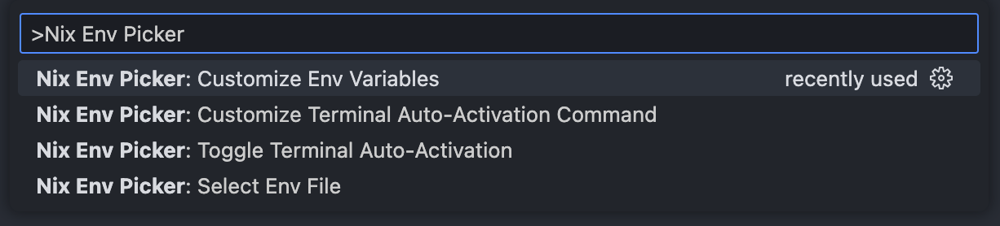

<div align="center">
    <h1>Nix Env Picker</h1>
    <p>
        <b>Development environment switcher for Nix shells and flakes</b>
    </p>
    <p>
        <a href="https://code.visualstudio.com/api"></a>
    </p>
    <p>
        <a href="#Overview">Overview</a> •
        <a href="#Features">Features</a> •
        <a href="#Getting-Started">Getting Started</a> •
        <a href="#Acknowledgements">Acknowledgements</a>
    </p>
</div>

## Overview

Nix Env Picker is a VS Code extension that makes it easy to switch between Nix development environments. It automatically loads environment variables from Nix into VS Code, ensuring your editor is always set up correctly. The extension can also activate your Nix environment in new terminals automatically and lets you customize the variables to fit your needs.



## Features

- **Auto activate development environments** in VS Code's integrated terminal
- **Customize environment variables** to inject into VS Code
- **Support for both Nix flakes and nix-shell** environments

## Getting Started

### Quick Usage
1. Install the extension
   - Install from the [VS Code Marketplace](https://marketplace.visualstudio.com/items?itemName=io-github-oops418.nix-env-picker)
   - Or search for "Nix Env Picker" in the Extensions view (Ctrl+Shift+X)
2. Create Nix environment files
   - Add either `flake.nix` or `shell.nix` to the root of your project workspace
3. Select your Nix environment
   - Open Command Palette (Ctrl+Shift+P or Cmd+Shift+P)
   - Run `Nix Env Picker: Select Env File`
   - Choose the Nix environment file you want to use
   - Reload VS Code according to the prompt

### Configuration

The settings to your `.vscode/settings.json`:

```json
{
   "nixEnvPicker.envFile": "${workspaceFolder}${/}flake.nix",
   "nixEnvPicker.terminalAutoActivate": true,
   "nixEnvPicker.terminalActivateCommand": "nix develop",
   "nixEnvPicker.customEnvVars": {
      "set": {
         "ENV_VARIABLE": "VALUE"
      },
      "unset": [
         "ENV_VARIABLE_TO_UNSET"
      ]
   }
}
```

#### Configuration Options

| Setting | Description | default |
|---------|-------------|---------|
| `nixEnvPicker.envFile` | Specifies the path to your Nix environment file. | null |
| `nixEnvPicker.terminalAutoActivate` | automatically activates the Nix environment in VS Code integrated terminal.| false |
| `nixEnvPicker.terminalActivateCommand` | The command used to activate the Nix environment in the terminal. | null |
| `nixEnvPicker.customEnvVars.set` | A key-value object specifying environment variables to set or override. | {} |
| `nixEnvPicker.customEnvVars.unset` | An array of environment variable names that should be unset/removed. | [] |

#### Supported Path Variables

| Path Variable              | Description                              |
|----------------------------|------------------------------------------|
| `${workspaceFolder}`         | The path of the workspace folder         |
| `${workspaceFolderBasename}` | The name of the workspace folder         |
| `${userHome}`               | The home directory of the current user   |
| `${pathSeparator}` or `${/}`   | The platform-specific path separator     |

## Important Notes

When using Nix Env Picker, please be aware of the following:

- **Nix File Requirements**:
  - Flake files must be named `flake.nix` and include proper outputs
  - Shell files must include `mkShell` in their definition

- **First-time Experience**:
  - Initial environment setup may take several minutes to download environment dependencies
  - **Tip**: Running `nix develop` or `nix-shell` directly in terminal first can pre-download dependencies

- **Behavior Explained**:
  - These settings you define for your project. They only affect VS Code itself, not the terminal inside it.
  - If you activate the Nix environment in your terminal without adding a special command, it will use the same environment file you’ve set in envFile for VS Code.

## Roadmap

- Support for custom command arguments

## Acknowledgements

Special thanks to [nix-env-selector](https://github.com/arrterian/nix-env-selector) for the inspiration behind this project. This extension builds upon the ideas presented in nix-env-selector while offering an alternative implementation.
